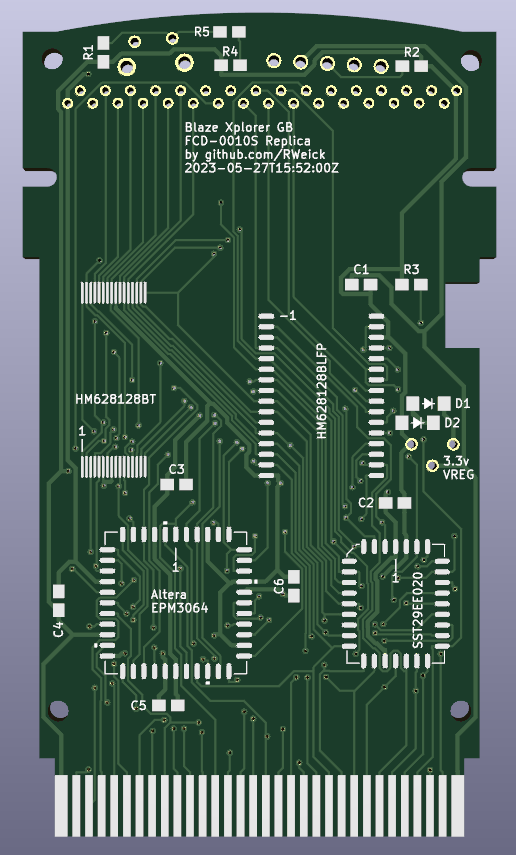

# FCD-0010S-Blaze-Xplorer-GB
The kicad files and binary firmware for the Blaze Xplorer GB. The diodes are used in series to create the necessary 3.3v expected by the Altera EPM3064. The footprints for a VREG exist below the diode pads, you may use either a 3.3 VREG or the diodes.

PCB Thickness: 0.8 mm

